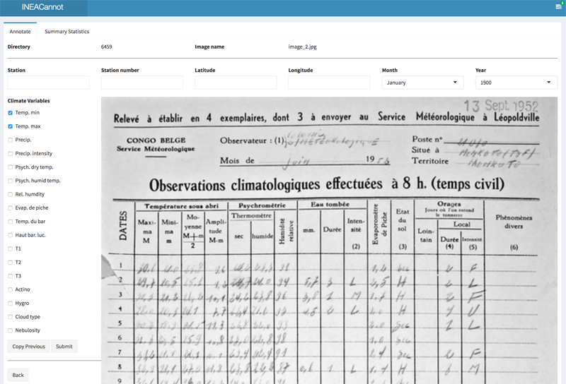

INEACannot
=======

A programmatic shiny interface to annotate meta-data from digitized data records in R.

Installation
------------

To install the development releases of the package run the following commands:

``` r
if(!require(devtools)){install.package("devtools")}
devtools::install_github("khufkens/ineacannot")
library("ineacannot")
```

Use
---

To start the shiny web interface use the following command, where the path variable points to the location of the images you want to annotate. The meta-data you provide is incrementally added to a file called **meta_data.csv saved at the same location**.

``` r
ineacannot(path = "/the/location/of/your/images/")
```

An interface will start in your default browser. Fill in the open fields, and flag all data types available and click the **submit** button. In case you are not sure or want to review a previous result click the **back** button. After reviewing the data clicking on the submit button will skip to the next record. 

For sequential climate data records there is a **copy previous** button which copies previous marked values and increments the month value. When the end of a year is reached, the year value will increment and the month value is set to January. This should speed up annotation of long sequential data records without minimal interaction.



Summary statistics and annotations progress is provided in the summary statistics tab.

Acknowledgements
----------------

This project was supported by the Belgian Science Policy Office (BELSPO) contract number BR/175/A3/COBECORE.